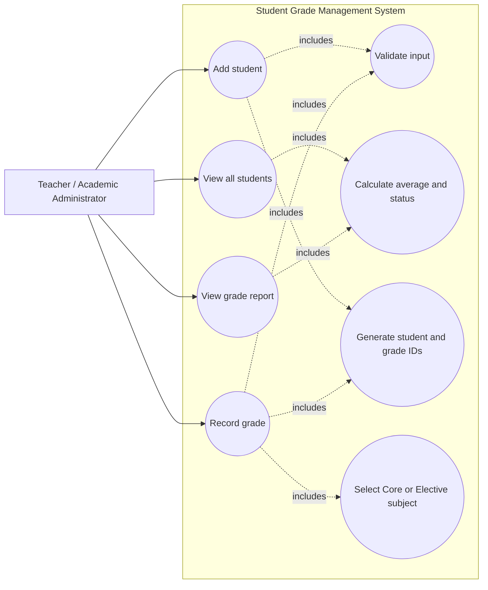

# Student Grade Management System: Use-Case Diagram

This use-case diagram represents the current lab scope. The Teacher or
Academic Administrator is the primary actor and interacts with the console
application to manage students and grades.

## Actors and use cases

| Element | Responsibility |
| --- | --- |
| Teacher / Academic Administrator | Uses the menu to manage student and grade information |
| Add student | Registers a Regular or Honors student |
| View all students | Displays student details, averages, and status |
| Record grade | Adds a Core or Elective grade to an existing student |
| View grade report | Shows a student's grade history and performance |
| Validate input | Ensures required fields and numeric ranges are valid |
| Calculate average and status | Determines the average and passing or failing status |
| Generate IDs | Creates unique student and grade identifiers |
