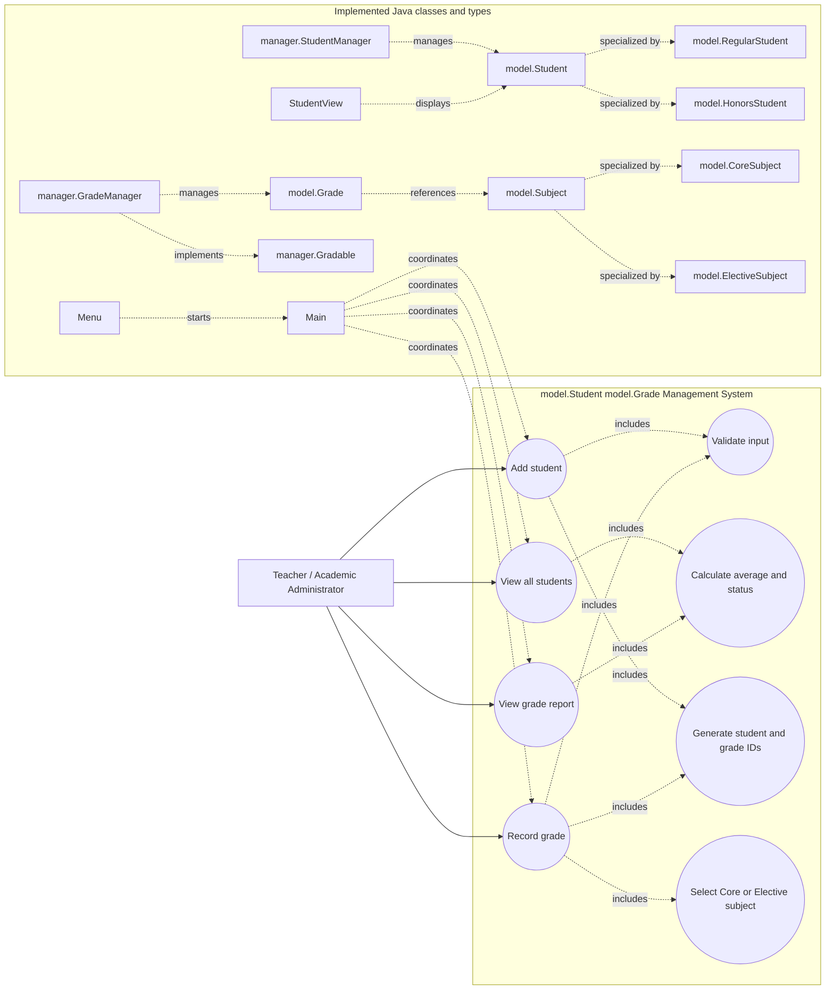

# model.Student model.Grade Management System: Use-Case Diagram

This use-case diagram represents the current lab scope. The Teacher or
Academic Administrator is the primary actor and interacts with the console
application to manage students and grades.

## Actors and use cases

| Element | Responsibility |
| --- | --- |
| Teacher / Academic Administrator | Uses the menu to manage student and grade information |
| Add student | Registers a Regular or Honors student |
| View all students | Displays student details, averages, and status |
| Record grade | Adds a Core or Elective grade to an existing student |
| View grade report | Shows a student's grade history and performance |
| Validate input | Ensures required fields and numeric ranges are valid |
| Calculate average and status | Determines the average and passing or failing status |
| Generate IDs | Creates unique student and grade identifiers |

## Implemented types shown in the diagram

| Type | Responsibility |
| --- | --- |
| `Main` | Coordinates the application operations and input validation |
| `Menu` | Displays the menu and controls navigation |
| `Student` | Abstract student state, grade array, and calculations |
| `RegularStudent` | model.Student subtype with a 50% passing threshold |
| `HonorsStudent` | model.Student subtype with a 60% passing threshold and honors eligibility |
| `Subject` | Abstract subject state and behavior |
| `CoreSubject` | Mandatory subject implementation |
| `ElectiveSubject` | Optional subject implementation |
| `Grade` | Validated grade value, subject, student ID, and date |
| `StudentManager` | Array-backed student storage and lookup |
| `GradeManager` | Array-backed grade history and lookup |
| `Gradable` | model.Grade validation and recording contract in `manager` |
| `StudentView` | model.Student display helper |
