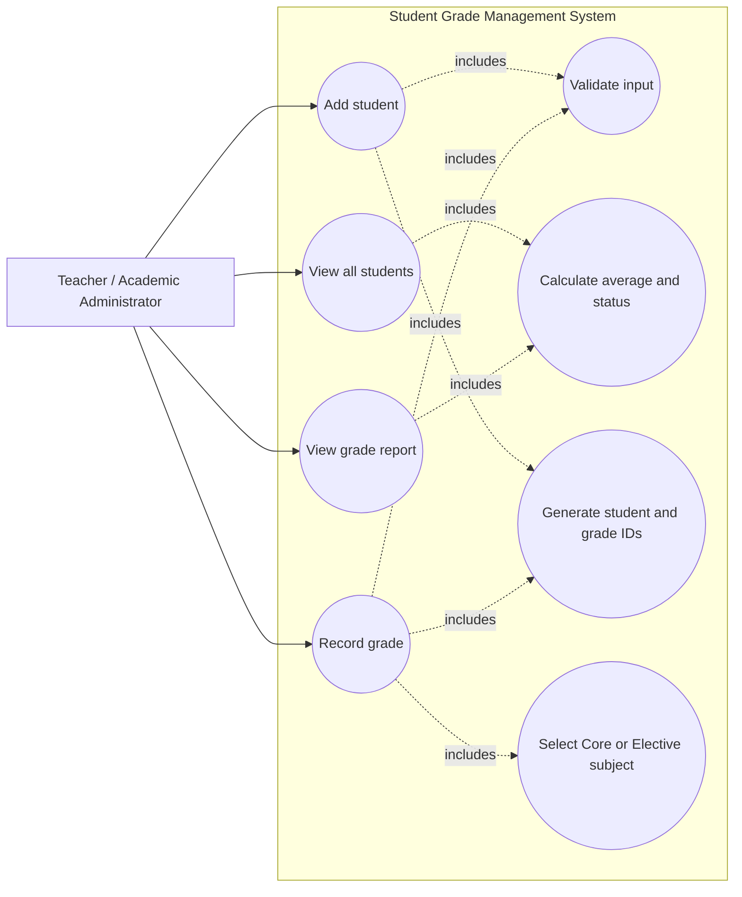

# Student Grade Management System

A Java console application for registering students and recording and reviewing
their academic grades. The project demonstrates encapsulation, inheritance,
polymorphism, composition, validation, and menu-driven interaction.

## Scope

The system is designed for a teacher or academic administrator who needs a
small in-memory register of students and grades. The current lab scope
includes:

- Adding Regular and Honors students
- Automatically generating student IDs (`STU001`, `STU002`, ...)
- Viewing all registered students, their average grades, and their status
- Recording Core and Elective subject grades from 0 to 100
- Automatically generating grade IDs and recording the grade date
- Viewing a student's grade history, average, passing grade, and status
- Validating required input and handling invalid menu selections

Data is kept in memory while the application is running. No database,
authentication, editing, deletion, or file export is currently included.

## Use-case diagram

The diagram below captures the implemented lab requirements. The Teacher is
the primary actor who uses the console menu; the student types and subject
types are domain concepts used by the system rather than separate users.



A standalone copy of the diagram is available in
[`docs/use-case-diagram.md`](docs/use-case-diagram.md).

## Requirements

- Java 25 or newer
- IntelliJ IDEA or any Java compiler
- No external libraries or database are required

Java 25 is recommended because the application uses `IO.readln`,
`IO.println`, records, and modern switch expressions.

## Project structure

```text
SGMS/
├── src/
│   ├── Main.java             # Application operations and input validation
│   ├── Menu.java             # Console menu and navigation loop
│   ├── Student.java          # Abstract student model and grade array
│   ├── RegularStudent.java   # 50% passing threshold
│   ├── HonorsStudent.java    # 60% passing threshold and honors eligibility
│   ├── Subject.java          # Abstract subject model
│   ├── CoreSubject.java      # Mandatory subject implementation
│   ├── ElectiveSubject.java  # Optional subject implementation
│   ├── Grade.java            # Grade model and validation
│   ├── StudentManager.java   # Array-backed student storage
│   ├── GradeManager.java     # Array-backed grade history
│   ├── Gradable.java         # Grade validation contract
│   └── StudentView.java      # Student display helper
├── docs/
│   └── use-case-diagram.md   # Use-case diagram for the lab submission
└── Student-Grade-Mgt-I.md    # Original lab brief and user stories
```

## Running the application

### IntelliJ IDEA

1. Open the project in IntelliJ IDEA.
2. Ensure the project SDK is Java 25 or newer.
3. Run `src/Main.java`.

### Command line

From the project root, compile the source files and start the application:

```powershell
New-Item -ItemType Directory -Force out | Out-Null
javac -d out src\*.java
java -cp out Main
```

On macOS or Linux, use `src/*.java` instead of `src\*.java`.

## Menu options

| Option | Function |
| --- | --- |
| 1 | Add a Regular or Honors student |
| 2 | View all students and the class average |
| 3 | Record a Core or Elective grade |
| 4 | View a student's grade report |
| 5 | Exit the application |

## Grading rules

| Student type | Passing grade |
| --- | ---: |
| Regular | 50% |
| Honors | 60% |

Core subjects are Mathematics, English, and Science. Elective subjects are
Music, Art, and Physical Education. A grade is valid only when it is between
0 and 100.

## Object-oriented design

- `Student` is an abstract class containing shared student state and grade
  calculations.
- `RegularStudent` and `HonorsStudent` override the student type and passing
  threshold, demonstrating inheritance and polymorphism.
- `Grade` is an immutable-style class with validation for student, subject, and
  grade range.
- `Student` composes a fixed-size array of `Grade` objects.
- `StudentManager` and `GradeManager` use arrays and counters to meet the lab
  storage requirement.
- `Main` coordinates the console use cases, while `Menu` handles navigation.
